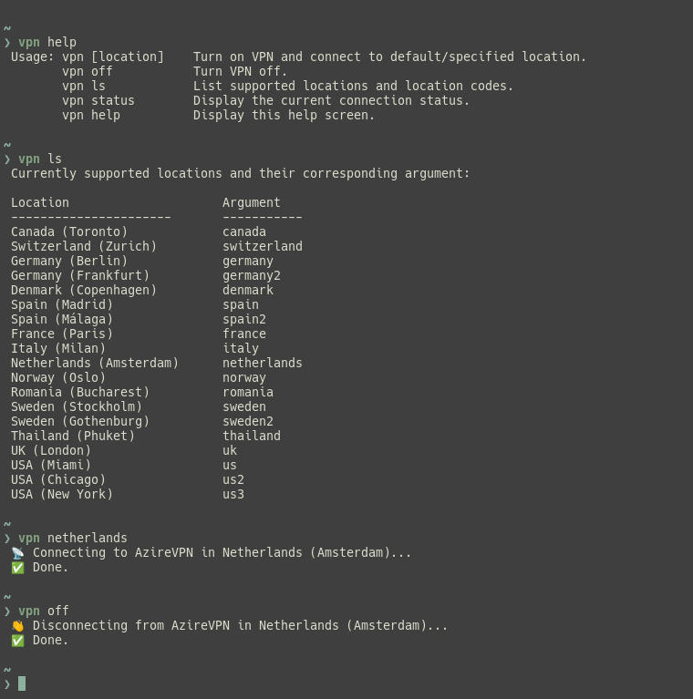

# vpn

An elegant command-line interface for AzireVPN’s WireGuard service for the [Fish shell](https://fishshell.com/).



## Install

[Fisher](https://github.com/jorgebucaran/fisher)

```console
fisher install alexavdb/vpn 
```

## Usage

### Connect to the default server

```sh
❯ vpn
```

Sample output:

```
 📡 Connecting to AzireVPN in Netherlands (Amsterdam)…
 ✅ Done.
```

### Connect to a specific server

```sh
❯ vpn germany
```

Sample output:

```
 ✅ You’re already connected to AzireVPN in Netherlands (Amsterdam).
 👋 Disconnecting from AzireVPN in Netherlands (Amsterdam)…
 📡 Connecting to AzireVPN in Germany (Berlin)…
 ✅ Done.
```

### Get list of currently supported servers

```sh
❯ vpn ls
```

Sample output:

```
Currently supported locations and their corresponding argument:

Location                     Argument
───────────────────────      ───────────
Canada (Toronto)             canada
Switzerland (Zurich)         switzerland
Germany (Berlin)             germany
Germany (Frankfurt)          germany2
Denmark (Copenhagen)         denmark
Spain (Madrid)               spain
Spain (Málaga)               spain2
France (Paris)               france
Italy (Milan)                italy
Netherlands (Amsterdam)      netherlands
Norway (Oslo)                norway
Romania (Bucharest)          romania
Sweden (Stockholm)           sweden
Sweden (Gothenburg)          sweden2
Thailand (Phuket)            thailand
UK (London)                  uk
USA (Miami)                  us
USA (Chicago)                us2
USA (New York)               us3
```

### Disconnect

```sh
❯ vpn off
```

Sample output:

```
 👋 Disconnecting from AzireVPN in Germany (Berlin)…
 ✅ Done.
```

### Get connection status

```sh
❯ vpn status
```

Sample output:

```
 ✅ You’re connected to AzireVPN in Netherlands (Amsterdam) via WireGuard.
```

```
 ❌ You are not connected to AzireVPN via WireGuard.
```

## Acknowledgements

This is a Fish shell alternative inspired by [Aral Balkan's original application.](https://source.small-tech.org/aral/vpn).

## License

[GPL-3.0-or-later](https://www.gnu.org/licenses/gpl-3.0.html)
